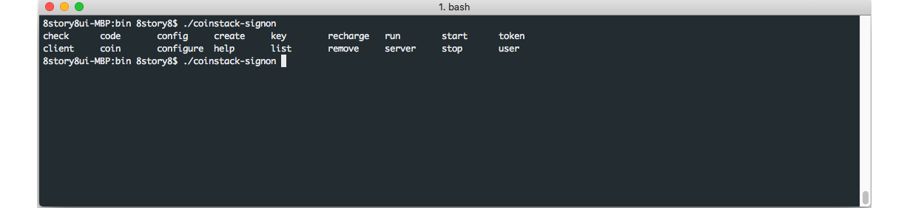

# 명령행 자동 완성

명령행을 사용해서 쉽게 조작하기 위해서 자동 완성 스크립트를 제공합니다. 설치 시 ~/.bash\_completion.d 안에자동완성 스크립트가 복사가 됩니다. 본 문서에서는 이를 삭제하였을시 다시 설정하는 방법을 다룹니다. 자동 완성 기능은 Bash 기반으로 작성되어 있습니다.

### 설치

자동 완성 스크립트를 설치할 디렉터리를 생성합니다.

```text
$ mkdir -p ~/.bash_completion.d
```

자동 완성 스크립트를 복사합니다.

```text
$ cp ${INSTALL_PATH}/doc/coinstack-signon.completion ~/.bash_completion.d
```

해당 파일을 읽어 들이는 스크립트를 ~/.bash\_completion 파일에 작성합니다.

```text
$ cat <<"EOF" >> ~/.bash_completion
for bcfile in ~/.bash_completion.d/* ; do
  . $bcfile
done
EOF
```

재로그인을 하거나 다음 명령으로 적용할 수 있습니다.

```text
$ . ~/.bash_completion
```

### 자동 완성 기능 확인

자동 완성 기능을 확인하기 위해 다음 명령을 실행합니다.

```text
$ coinstack-signon [tab]
```

아래와 같이 수행할 수 있는 명령들을 보여줍니다.



