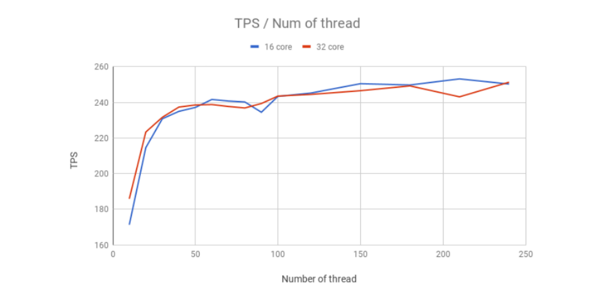
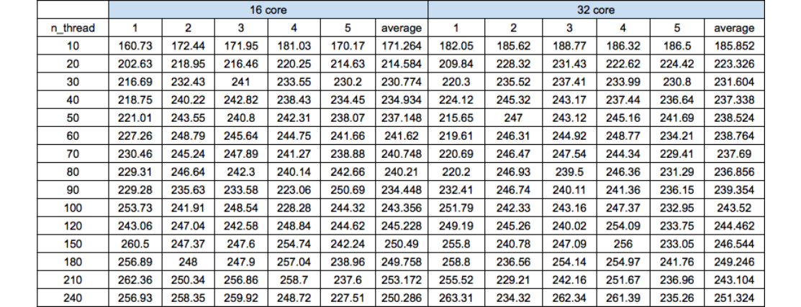

# 성능

Azure 기반 가상머신에서 진행된 부하 테스트의 결과를 보여줍니다. 테스트는 서버와 노드를 같은 PC에 설치한 후사용자의 수를 바꿔가며 5분간 진행한 후 5분간의 평균 TPS\(Transfer Per Second\)를 측정하였습니다. 편차를 줄이기 위해 같은 시나리오로 5번 측정한 후 결과를 평균 내었습니다. 테스트는 2.4GHz Intel Xeon® E5-2673v3\(Haswell\) 프로세서 또는 최신 2.3GHz Intel XEON® E5-2673 v4\(Broadwell\) 프로세서를 기반으로 하는Dsv3 시리즈에서 Standard\_D16s\_v3\(16코어/64기가 메모리\), Standard\_D32s\_v3\(32코어/128기가\) 시리즈의 가상머신을 구축한 후 수행하였습니다. 가상머신에 대한 자세한 정보는 다음의 URL에서 확인할 수 있습니다.

[https://docs.microsoft.com/ko-kr/azure/virtual-machines/windows/sizes-general](https://docs.microsoft.com/ko-kr/azure/virtual-machines/windows/sizes-general)

#### 결과

결과 그래프를 보면 스레드의 개수가 증가함에 따라 30개 정도까지는 TPS\(Transfer Per Second\)가 선형적으로증가하다가 그 이후로는 완만하게 증가하는 것을 볼 수 있습니다. 이후 스레드의 개수가 증가함에 따라 TPS가 250정도에 수렴하는 것을 확인할 수 있습니다. 자세한 측정 결과는 다음의 도표에서 확인할 수 있습니다.

