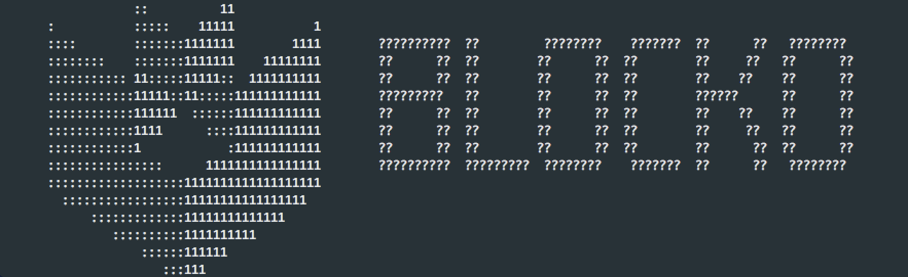
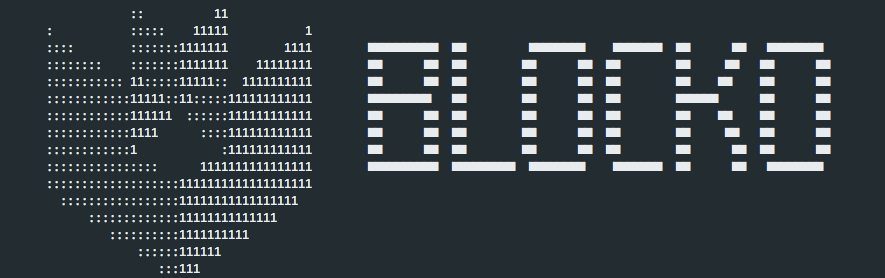

# 문자셋 미지정

OS는 각각 사용자가 어떤 언어를 사용하는지에 대한 문자 집합인 Locale을 가지고 있습니다.

만일 Locale이 지정되지 않으면, 한글이나 특수 문자를 읽고 쓰는 데 문제가 있을 수 있습니다.

만일 Locale에 문제가 있다면, SignOn 서버 시작 시 출력되는 배너가 깨져서 보이는 현상이 발생합니다.



다음 명령어를 통해 Locale을 추가하여 문제를 해결합니다. \(CentOS의 경우\)

```text
# localedef -f UTF-8 -i ko_KR ko_KR.UTF-8
```

문자셋이 올바르다면 다음과 같은 배너를 볼 수 있습니다.



