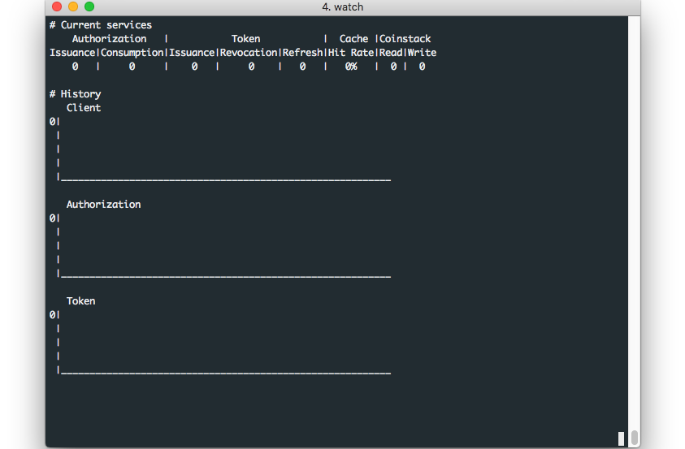
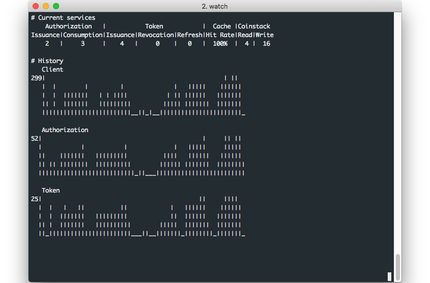

# 서버 관리

Coinstack SignOn 서버는 '**./coinstack-signon server 명령어'** 로 관리할 수 있습니다.

### 서버 실행

Coinstack SignOn 서버는 다음의 명령어를 통해 실행 가능합니다.

#### **일반 실행**

```text
$ coinstack-signon server run
```

#### **데몬 실행**

run 으로 서버를 실행하는 경우 run 명령이 끝나게 되면 프로세스가 소멸하지만 데몬 구동은 명령이 끝나도 백그라운드 process가 유지됩니다.

데몬 실행을 하는 방법은 run에 --daemon 옵션을 추가하거나 server start라는 명령어를 사용하시면 됩니다.

```text
$ coinstack-signon server run --daemon
```

```text
$ coinstack-signon server start
```

구동이 완료되면 아래와 같은 문구가 나옵니다.

```text
Server started
```

#### **프로필 설정**

프로필을 사용하면 미리 설정해 놓은 환경설정 파일들을 반영할 수 있습니다.

프로필은 다음의 명령어를 통해 사용 가능합니다.

```text
$ coinstack-signon server start --profile test
$ coinstack-signon server run --profile test
```

### 서버 종료

Coinstack SignOn 서버는 다음의 명령어를 통해 종료 가능합니다.

```text
$ coinstack-signon server stop
```

종료가 잘 되면 하단의 문구가 출력됩니다.

```text
Server stopped
```

### 서버 재실행

Coinstack SignOn 서버는 다음의 명령어를 통해 재실행 가능합니다.

```text
$ coinstack-signon server restart
```

### 서버 상태 확인

서버가 정상적으로 서비스를 제공하는지 HTTP 요청을 통해 확인할 수 있습니다.

다음의 명령어를 통해 상태 확인이 가능합니다.

```text
$ coinstack-signon server check
```

* 서버가 부팅 중인 경우

```text
Server is booting
```

* 서버가 구동 중인 경우

```text
Server is running
```

* 서버가 구동 중이지 않은 경우

```text
Server stopped
```

### 서버 현황

서버의 OAuth 2.0 서비스 현황을 도표 및 그래프를 통해 실시간으로 확인할 수 있습니다.

다음의 명령어를 통해 사용 가능합니다.

```text
$ coinstack-signon server monitor
```

만약, 다음과 같은 문구가 출력된다면. 서버가 실행 중인지 확인하시고 다시 시도해주시기 바랍니다.

```text
No process detected
```

정상적으로 명령어가 실행되면 다음과 같은 화면을 확인할 수 있습니다.

이와 같이 화면이 출력되는 이유는 OAuth 2.0 서비스를 이용하지 않았기 때문입니다.



따라서 [기능 테스트](../../appendix/undefined-3/undefined.md), [부하 테스트](../../appendix/undefined-3/undefined-1.md) 등의 OAuth 2.0 서비스를 이용하면, 다음과 같이 서버 현황을 확인할 수 있습니다.



확인할 수 있는 리소스의 종류는 다음과 같습니다.

| 리소스 종류 | 의미 |
| --- | --- | --- | --- | --- | --- |
| Authorization Issuance/Consumption | 인가코드 발행 / 소비 개수 |
| Token Issuance/Revocation/Refresh | 액세스 토큰 발행 / 무효 / 리프레시 개수 |
| Cache Hit Rate | 캐쉬 적중률 |
| Coinstack Read/Write | 서버와 코인스택 노드 간의 상호작용 개수\(Read / Write\) |
| History Client/Authorization/Token | Client/Authorization/Token의 History 그래프 |

