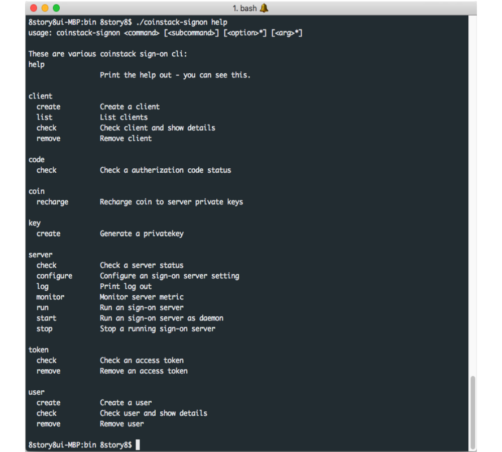

# 도움말 확인

Coinstack SignOn은 OAuth 2.0 인증 서비스의 실행 가능한 명령어 목록을 확인할 수 있는 도움말 확인 명령어를제공합니다.

실행 가능한 명령어들의 자세한 사항은 [Coinstack SignOn 시작하기](./)에 포함되어 있습니다.

### 실행 가능한 명령어 목록 확인하기

사용자는 실행 가능한 명령어 목록을 확인하기 위해 다음과 같은 명령어를 입력합니다.

```text
$ coinstack-signon help
```

명령어를 입력하면 다음과 같은 화면이 출력되며, 실행 가능한 명령어 목록들을 확인할 수 있습니다.



### 상세 도움말

명령 카테고리별로 상세한 도움말을 제공하고 있습니다. 다음과 같이 명령을 입력해 보시면 더 쉽게 이해할 수 있습니다.

```text
$ coinstack-signon help code
```

