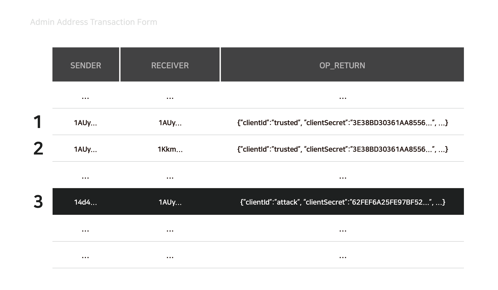

# Coinstack SignOn

Coinstack SignOn은 블록체인 기반의 사인-온\(Blockchain-based Sign On\)의 개념을 구현한 구현체입니다. 사인-온 절차의 이해와 타 시스템과의 연계 편의성을 위해 표준인 OAuth 2.0 프로토콜을 준수하며, 공유된 원장이라는블록체인의 특성을 잘 활용한 제품입니다. 외부의 침입으로 인해 서버가 노출되어도 서버를 관리하는 개인키만 탈취되지 않으면 시스템을 마음대로 변조할 수 없어 뛰어난 보안성을 가집니다.

## 서버 구조

Coinstack SignOn 서버는 Spring Boot 2.0기반으로 구현되어 있습니다. Spring Security OAuth2의 엔드포인트와 서비스들을 활용하고 있습니다.

## 인증 및 확인 절차

다음은 Coinstack SignOn의 인증 및 확인 절차입니다.

## 관리자 어드레스

관리자 어드레스는 클라이언트\(Client\), 사용자\(User\)를 관리하는 어드레스입니다.

※ 마이닝 어드레스를 사용하는 경우 UTXO가 많이 발생하여 부하가 생길 수 있습니다.

* 사용자 등록 시 관리자 어드레스는 2개의 트랜잭션을 발생시킵니다.
* **수신자**가 **관리자 어드레스**인 트랜잭션
  * 관리자 어드레스에 클라이언트 정보를 기록함으로써 리스트 관리가 가능합니다.
* **수신자**가 **clientId로 추출한 어드레스**인 트랜잭션
  * clientId로 추출한 어드레스에 클라이언트 정보를 기록함으로써 개별 관리가 가능합니다.
* 타 유저가 임의의 클라이언트 데이터를 등록한 경우
  * 블록체인에서 데이터를 조회할 때 **Input 값이 관리자 어드레스**인 데이터들을 유효하다고 판단하기 때문에 관리자가 아닌 타 어드레스에서 등록한 클라이언트 정보들은 **적용되지 않습니다.**

※ 클라이언트의 경우 **수가 많지 않아** 블록체인에서 관리하지만, User의 경우 많게는 수만 개 이상의 데이터를 보유하기 때문에 블록체인으로 따로 **관리하지 않습니다**. 이에 대한 자세한 사항은 [사용자 인증 연동하기](../../utilization/user_repository/)장을 참조합니다.

## 서버 개인키

서버 개인키는 인가 코드\(Authorization code\), 액세스 토큰\(Access token\)을 생성하는데 사용되는 개인키 입니다. 서버 개인키는 하나의 서버에만 할당해야 하며, 서버는 여러 개인키를 가질 수 있습니다. 즉 서버 vs 개인키는 1:N의 관계를 맺습니다. 인가 코드와 액세스 토큰과 관련된 거래는 서버 어드레스나 관리자 어드레스에서 나온 거래에 대해서만 유효성이 인정됩니다. 따라서, 임의의 공격자가 인가 코드를 발행하거나 발행된 액세스 토큰을 무효화\(expire\)할 수 없습니다.

※ 마이닝 어드레스를 사용하는 경우 UTXO가 많이 발생하여 부하가 생길 수 있습니다.

### 서버 피어 주소

여러 Coinstack SignOn로 구성된 시스템이라면, 하나의 서버가 발행한 액세스 토큰을 다른 서버에서도 인지할 수있어야 합니다. 따라서, 서버별로 개인키들을 따로 지정하는 것과 동시에 이러한 개인키의 주소들을 모두 알고 있어야합니다.

## E**ndpoint**

Coinstack SignOn 서버에서 제공하는 OAuth 2.0 인증 서비스의 엔드포인트는 다음과 같습니다.

| Path | API 설명 | 비 고 |
| --- | --- | --- |
| /oauth/authorize | 클라이언트의 정보를 받아 접근 권한을 확인해주는 엔드포인트 |  |
| /oauth/token | 액세스 토큰을 발급해주는 엔드포인트 |  |
| /oauth/check\_token | 액세스 토큰을 확인해주는 엔드포인트 |  |
| /oauth/logout | 로그아웃해주는 엔드포인트 |  |
| /oauth/error | 에러 발생 내용을 보여주는 엔드포인트 |  |

### **/oauth/authorize**

클라이언트의 정보를 받아 **접근 권한을 확인**해주는 엔드포인트

#### **Query Parameters**

| Parameter | Description | Values |
| --- | --- | --- |
| response\_type | 사용할 권한 부여 처리 과정을 결정   Authorization Code, Implicit 방식에서 사용 | String   · code   · token |
| grant\_type | 인가 증명 방식을 결정하기 위해 사용 | String   · authorization\_code   · implicit   · password   · client\_credentials |
| scope | 클라이언트에서 사용자에게 허가를 요구하는 범위 |  |
| client\_id | 클라이언트 식별자 |  |
| secret | 클라이언트 비밀번호 |  |
| redirect\_uri | SignOn 서버에서 인증/인가 후 반환되는 URI |  |

#### **Response**

| Parameter | Description |
| --- | --- |
| 200 | OK |
| 302 | Redirection |
| 401 | Bad Client Credentials |
| 500 | Error |

### **/oauth/token**

**액세스 토큰을 발급**해주는 엔드포인트

#### **Query Parameters**

| Parameter | Description | Values |
| --- | --- | --- |
| grant\_type | 인가 증명 방식을 결정하기 위해 사용 | String   · authorization\_code   · password   · client\_credentials   · refresh\_token |
| redirect\_uri | SignOn 서버에서 인증/인가 후 반환되는 URI |  |
| code | 인가 증명 방식이 Authorization Code 방식일 경우 사용 |  |
| username | 인가 증명 방식이 Password 방식일 경우 사용 |  |
| password | 인가 증명 방식이 Password 방식일 경우 사용 |  |
| refresh\_token | 인가 증명 방식이 Refresh Token 방식일 경우 사용 |  |

#### **Response**

| Parameter | Description | Values |
| --- | --- | --- |
| access\_token | 액세스 토큰값 |  |
| refresh\_token | 리프레시 토큰값 |  |
| scope | 클라이언트에서 사용자에게 허가를 요구하는 범위 |  |
| token\_type | 액세스 토큰의 타입 | String   · bearer |
| expires\_in | 액세스 토큰 만료 시간 |  |

### **/oauth/check\_token**

액세스 토큰을 확인해주는 엔드포인트

#### **Query Parameters**

| Parameter | Description | Values |
| --- | --- | --- |
| token | 확인할 액세스 토큰값 |  |

#### **Response**

| Parameter | Description |
| --- | --- |
| user\_name | 사용자 식별자 |
| scope | 클라이언트에서 사용자에게 허가를 요구하는 범위 |
| authorities | 사용자 접근 권한 |
| client\_id | 클라이언트 식별자 |

### **/oauth/logout**

로그아웃을 하고 accessToken을 만기하는 엔드포인트

access\_token, redirect\_uri 인자는 필수적이며 로그아웃이 완료되면 **${REDIRECT\_URI}**로 리다이렉션됩니다.

#### **Query Parameters**

| Parameter | Description | Values |
| --- | --- | --- |
| access\_token | 만료할 액세스 토큰값 |  |
| redirect\_uri | 사용 중인 redirect\_uri |  |

### **/oauth/confirm\_access**

**userApprovalPage**로 리다이랙션시켜주는 엔드포인트

사용자가 허가의 승인을 확인하는 POST 요청을 받습니다.

### **/oauth/error**

에러 발생 내용을 보여주는 엔드포인트

