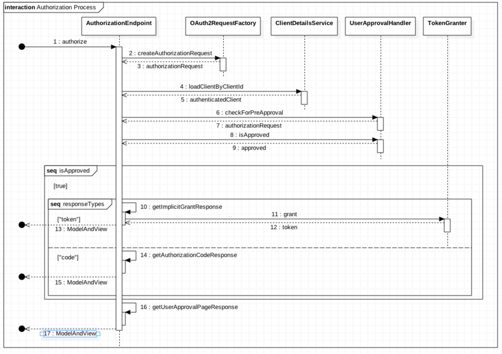
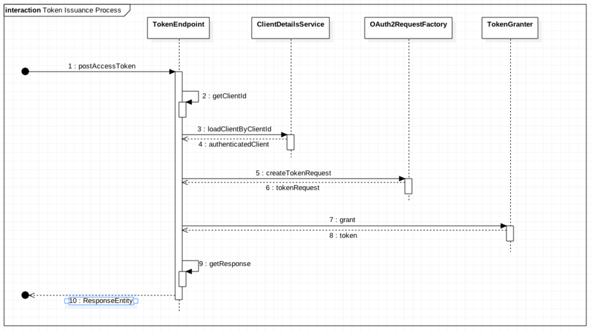
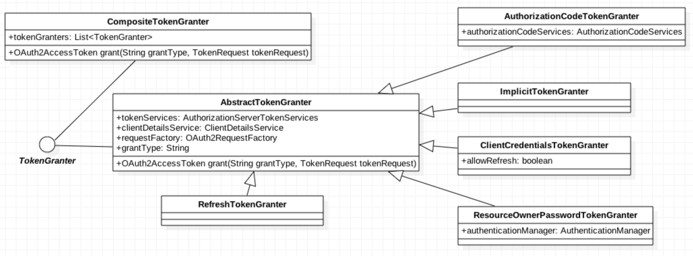

# 주요 모델

### 논리 모델

SignOn에서는 AccessToken과 관련된 모델이 가장 중요하고 빈번하게 사용됩니다.

관련 모델은 다음과 같습니다.

이 모델을 이해하기 위해서 현실에서 일어나는 일을 예로 들어보겠습니다.

> 당신이 인터넷으로 영화를 예매하고, 극장에 가서 입장권을 발매하여 입장하는 과정은 우리가 제공하는 사인온행위와 매우 닮아있습니다. 입장권을 발매하기 위해 당신은 신분증\(Authentication\)을 제시합니다. 입장권 발매자는 신분증을 확인하고 입장권\(Access Token\)을 발행하게 됩니다. 극장의 앞에서는 표를 확인하는 직원이 입장을 통제\(Access Control\)합니다. 만일, 표를 잃어버렸을 때는 다시 신분증을 가지고 가서 표를 재발행하거나 기존의 표가 동작하지 않도록 하는 작업을 해야 합니다. 이러한 이유로 Authentication 정보에Access Token의 값이 있어야 합니다.
>
> 이 경우, 신분증을 통한 작업의 경우 표를 다시 발행하는 행위인데 이 과정을 좀 더 손쉽게 하기 위한 방법으로리프레쉬 토큰을 제공합니다. 이것은 신분증보다는 구매 번호 또는 예약 번호에 비유할 수 있습니다. 신분 인증없이 액세스 토큰을 재발행할 수 있도록 합니다.

이러한 이유로 액세스 토큰을 발행하기 위해서는 인증 정보와 리프레쉬 토큰을 함께 기록해야 합니다.

### Endpoint별 동작

#### AuthorizationEndpoint

#### TokenEndpoint

해당 요청들은 최종적으로 모두 TokenGranter를 통해 token을 발행하도록 요청합니다. 그 과정에서Authorization code를 발행하거나 사용자의 인가를 받기도 하지만 최좀 목표는 토큰을 발행받는 것이기 때문에 이는 당연합니다.

### TokenGranter

TokenGranter를 구현한 클래스들입니다. 이 클래스에서 사용하는 인터페이스와 그 구현체는 다음과 같습니다.

| 인터페이스| 제공되는 구현체|
| --- | --- | --- | --- |
| AuthorizationServerTokenServices | coinstack.signon.server.service.CoinstackTokenService |
| ClientDetailsService | coinstack.signon.server.service.CoinstackClientService |
| AuthorizationCodeServices | coinstack.signon.server.service.CoinstackAuthorizationCodeService |

