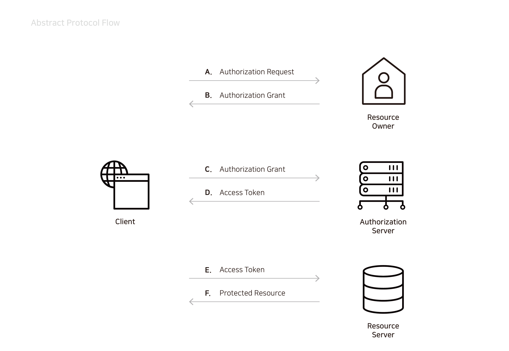

# 개념 및 용어

### 개념

OAuth 2.0은 애플리케이션이 Facebook, Google, GitHub와 같은 서비스의 사용자 계정에 대한 제한된 액세스 권한을 얻을 수 있게 해주는 인가 프레임워크입니다. 이는 사용자 계정을 호스팅하는 서비스에 사용자 인증을 위임하고타사 응용 프로그램에 사용자 계정에 대한 액세스 권한을 부여하여 작동합니다. OAuth는 웹 및 데스크톱 응용 프로그램 및 모바일 장치에 대한 인증 흐름을 제공합니다.

Coinstack SignOn은 블록체인을 이용하여 개발되었으며 Facebook, Google, GitHub와 같은 서비스 제공자의입장에서 OAuth 서비스를 제공할 수 있게 합니다. Coinstack SignOn 플랫폼은 귀사의 계열사, 자회사, 귀사의 고객을 공유하고자 하는 협력사, 신규 육성하는 앱 등에 적용할 수 있습니다. 귀사의 서비스를 이용하는 사용자들에게 다른 서비스에 접근할 기회를 제공하고 귀사의 서비스에 대한 사용을 늘리며 관리할 수 있습니다.

### 용어

#### Authentication\(인증\)

인증은 현재 사용자의 신원을 확인하여 증명이 완료된 사용자에게 리소스 접근을 허용하는 것입니다.

#### Authorization\(인가\)

인가는 특정 리소스에 접근할 수 있는 권한을 부여하는 것으로 접근 제어라고 볼 수 있습니다.

#### Protected Resource

OAuth 절차상에서 접근하려 하는 대상 자원. 웹상의 페이지, 미디어 파일과 같은 것들이 예가 됩니다.

#### Resource Owner\(사용자\)

제한된 리소스에 접근을 허용하는 주체로 자신의 계정에 접근하기 위해 **애플리케이션을 인증하는 사용자**입니다. 응용 프로그램의 사용자 계정 액세스 권한은 부여된 권한\(예 : 읽기 또는 쓰기 권한\)의 "범위"로 제한됩니다. 귀사의 서비스에 가입된 각각의 사용자가 리소스 오너가 될 수 있습니다. **사이트를 이용하는 사용자**일 수도 있으며, **앱을 이용하는사용자**가 될 수도 있습니다.

#### Authorization Server\(인가 서버\)

인가 서버는 **리소스** **오너의 ID를 검증하는 서버**입니다. 인가 서버는 사용자의 ID를 검증한 이후 액세스 토큰을 응용 프로그램에 발행합니다. 액세스 토큰을 발급받은 클라이언트, 사용자는 해당 액세스 토큰을 리소스에 접근하기 위해 사용합니다.

예를 들어 Facebook Oauth2를 이용하는 경우 인가 서버는 Facebook이 됩니다.

#### Resource Server \(API 서버\)

리소스 서버는 제한된 리소스를 제공하는 서버를 의미합니다. 클라이언트와 사용자는 리소스 서버에 접근하기 위해인가 서버에서 발급받은 액세스 토큰을 사용합니다. 리소스 서버는 액세스 토큰을 검증하여 사용자의 정보에 접근할권한을 체크합니다.

#### Client\(접근 대상\)

클라이언트는 사용자의 계정에 액세스하려는 응용 프로그램입니다. 하지만 그 전에 사용자가 권한을 부여받아야 하며권한의 체크와 승인은 리소스 서버에 의해 확인되어야 합니다.

### Protocol Flow

OAuth 2.0 인증 서비스의 흐름은 다음과 같습니다.

A. 클라이언트는 리소스 오너에게 제한된 리소스의 접근 허가를 요청합니다.

B. 리소스 오너는 이를 허가합니다.

C. 클라이언트는 인가 서버에 리소스 오너의 허가를 증명합니다.

D. 인가 서버는 클라이언트의 증명에 문제가 없음을 증명하는 액세스 토큰\(Access token\)을 발행합니다.

E. 액세스 토큰을 리소스 서버에 보내서 리소스를 요청합니다.

F. 리소스 서버는 리소스를 반환합니다.

