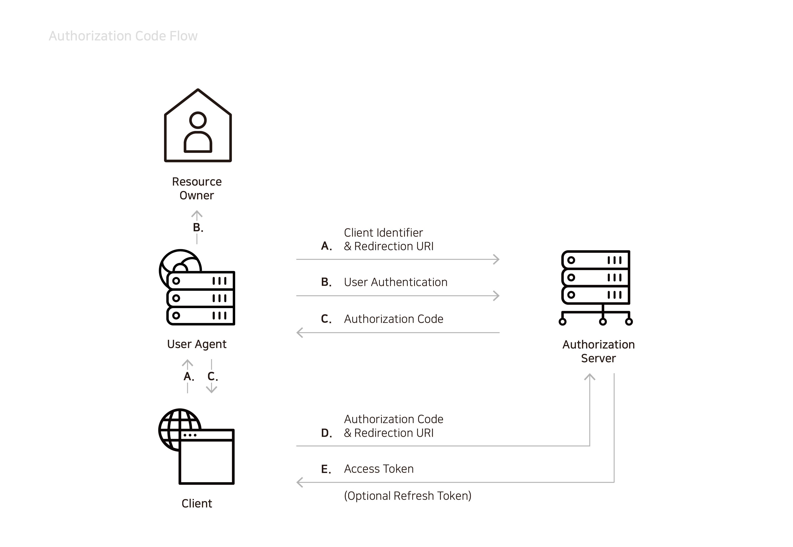
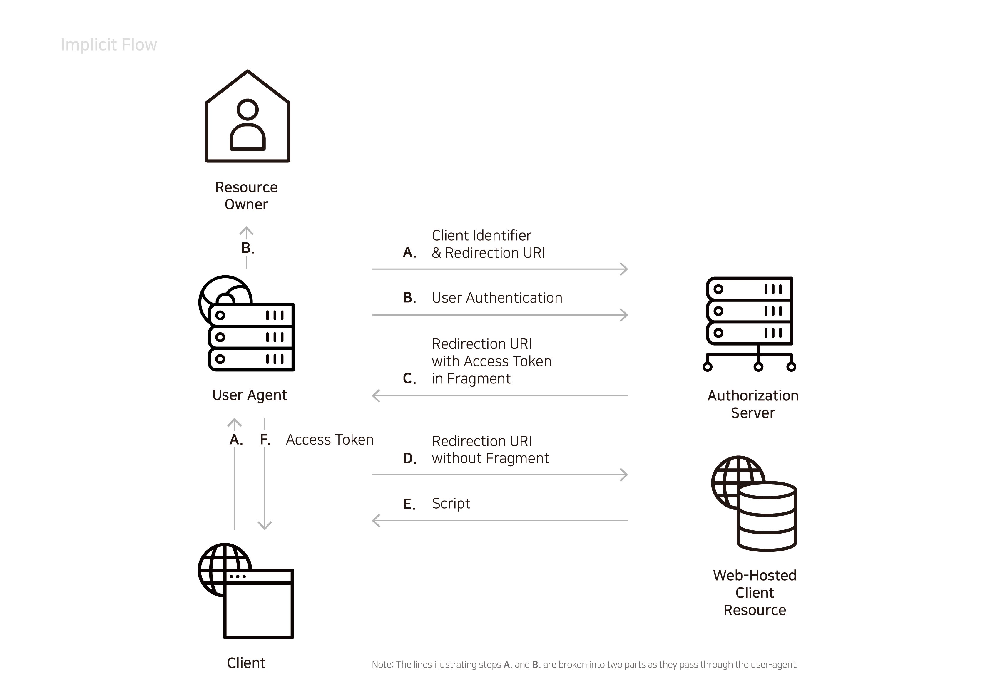
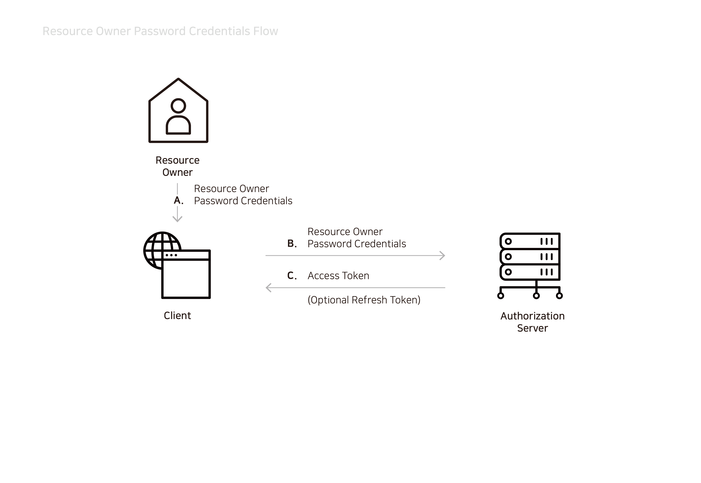
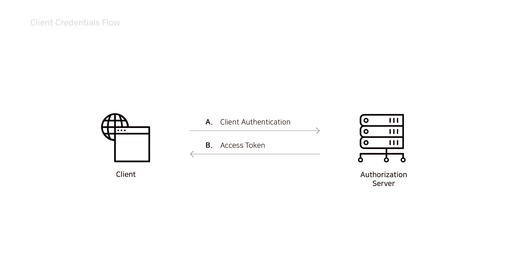

# 인가 증명\(Grant\)

OAuth 2.0의 인가 증명을 위한 좋은 방법을 제안하고 있을 뿐만 아니라 표준안에 포함되어 있지 않은 더 많은 활용예제가 존재합니다.

### 표준 인가 증명

#### 인가 코드\(Authorization Code\)

액세스 토큰\(Access token\)을 얻기 위해 사용되며, **confidential** 클라이언트에 최적화된 방법입니다. Redirection에 기반을 둔 절차이기 때문에 클라이언트는 사용자가 조작하는 프로그램\(Browser\)과 상호 작용할 수 있어야 합니다.

A. User agent는 클라이언트 ID와 리다이렉트할 클라이언트의 URI를 인가 서버에 전달합니다.

B. 사용자 인증을 인가 서버에게 요청합니다.

C. 인가 서버는 인증에 성공하면 인가 코드를 리다이렉트 URI에 포함해서 리다이렉트합니다.

D. 인가 코드를 받은 클라이언트는 인가 코드를 A 번의 리다이렉트 URI에 포함해서 액세스 토큰을 요청합니다.

E. 인가 서버는 액세스 토큰을 발행합니다.

#### 암묵적 증명\(Implicit\)

인가 코드 방식에서 인가 코드 발행 절차를 생략한 방식입니다. 리프레시 토큰은 발행되지 않으며, **public** 클라이언트에 최적화된 절차입니다.

A. User agent는 클라이언트 ID와 리다이렉트할 클라이언트의 URI를 인가 서버에 전달합니다.

B. 사용자 인증을 인가 서버에게 요청합니다.

C. 인가 서버는 인증에 성공하면 액세스 토큰을 포함한 리다이렉트 URI를 Fragment에 포함해서 리다이렉트합니다.

D. 액세스 토큰을 받은 User agent는 Fragment를 제거한 URI를 요청합니다.

E. 액세스 토큰을 추출하기 위한 스크립트를 전달합니다.

F. User agent는 스크립트를 통해 클라이언트에 액세스 토큰을 전달합니다.

#### 패스워드 방식\(Password\)

리소스 오너와 클라이언트에 신뢰가 있을 때 사용하는 방식입니다. 장치의 OS나 관리자 권한으로 실행된 애플리케이션, 또는 클라이언트가 인가 서버가 같은 시스템인 경우에 적합합니다.

A. 리소스 오너는 패스워드 자격 증명을 클라이언트에 전달합니다.

B. 클라이언트는 이 자격 증명을 인가 서버에 전달합니다.

C. 인가 서버는 액세스 토큰을 발행합니다.

#### 클라이언트 자격 증명\(Client Credentials\)

클라이언트 자격 증명만으로 액세스 토큰을 발행할 수 있는 방식입니다. **confidential** 클라이언트만 사용해야 합니다.

A. 클라이언트 인증을 인가 서버에 전달합니다.

B. 인가 서버는 액세스 토큰을 발행합니다.

### 인가 증명 확장

표준안에 포함되지 않은 방식이더라도 grant\_type 인자값을 URI로 지정해서 사용할 수 있습니다. 아래의 예시 외에수많은 확장 예제가 존재합니다.

#### SAML 2.0 Bearer Assertion Profiles for OAuth 2.0

SAML 2.0 을 사용하여 인증/인가를 하는 표준안입니다. 복잡한 규칙의 인증/인가 절차를 적용할 수 있습니다.

자세한 내용은 [https://tools.ietf.org/html/draft-ietf-oauth-saml2-bearer-09](https://tools.ietf.org/html/draft-ietf-oauth-saml2-bearer-09)를 확인해 보시기 바랍니다.

#### 장치 코드

플레이스테이션이나 YouTube 플레이어 같은 장치상에서 애플리케이션\(또는 서비스\)으로 접근할 때 사용하는 인가증명 방법입니다.

자세한 내용은 [https://alexbilbie.com/2016/04/oauth-2-device-flow-grant/](https://alexbilbie.com/2016/04/oauth-2-device-flow-grant/)를 확인해 보시기 바랍니다.

