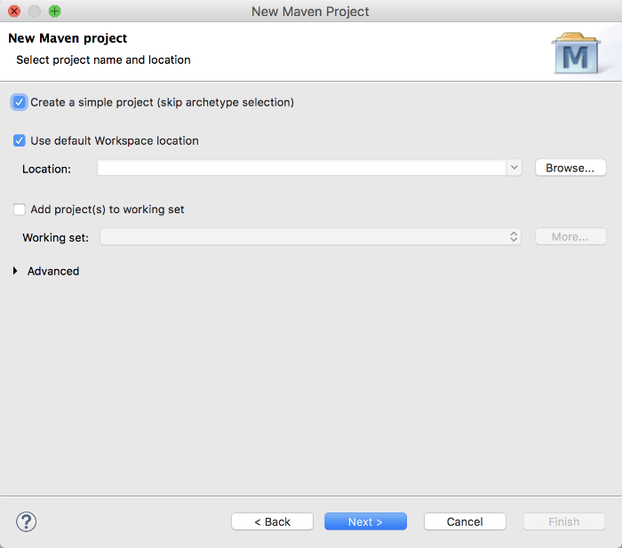

# Spring 프로젝트 설정

## 프로젝트 설정

본 장에서는 Eclipse와 Maven을 이용하여 개발 환경을 구성하는 방법에 관해서 설명합니다.

지금부터 생성하는 프로젝트는 스프링 기반의 리소스 서버를 생성하는 예제입니다.

### Eclipse에서 Maven 프로젝트 생성하기

개발 환경인 Eclipse에서 인증 모듈 개발을 위한 프로젝트를 생성하겠습니다.

먼저 메뉴에서 File -&gt; New를 선택하고, 리스트에서 **Maven Project**를 선택하고 다음으로 진행합니다.


**Create a simple project**를 체크하고, 다음 단계로 진행합니다.



&lt;group-id&gt;와 &lt;artifact-id&gt;를 입력하고, 과정을 종료하면 프로젝트가 생성됩니다.


### pom.xml 설정하기

개발을 진행하기 위해서는 Maven 저장소에서 라이브러리들을 가져와야 합니다. BLOCKO, Inc는 개발에 필요한 모든 라이브러리를 인터넷을 통해 제공합니다. 인터넷이 단절된 환경에서 개발하기 위해서는 해당 라이브러리를 직접다운로드받아서 프로젝트를 구성할 수 있습니다. 관련 라이브러리를 프로젝트에 포함하기 위해서는${PROJECT\_HOME}/pom.xml 파일을 수정해야 합니다.

#### 라이브러리 추가

pom.xml에서는 라이브러리를 가져오기 위해서 Maven 저장소 정보를 입력하고, 필요한 라이브러리를 의존성에 정의합니다.

```markup
<parent>
    <groupId>org.springframework.boot</groupId>
    <artifactId>spring-boot-starter-parent</artifactId>
    <version>2.0.0.RELEASE</version>
    <relativePath /><!-- lookup parent from repository -->
</parent>
...
<properties> 
    <project.build.sourceEncoding>UTF-8</project.build.sourceEncoding>
    <project.reporting.outputEncoding>UTF-8</project.reporting.outputEncoding>
    <java.version>1.8</java.version>
</properties>
...
<dependencies>
    <!-- json -->
    <dependency>
        <groupId>org.json</groupId>
        <artifactId>json</artifactId>
        <version>20080701</version>
    </dependency>
    
    <!-- spring boot -->
    <dependency>
        <groupId>org.springframework.boot</groupId>
        <artifactId>spring-boot-starter-web</artifactId>
    </dependency>
    
    <!-- jsp -->
    <dependency>
        <groupId>javax.servlet</groupId>
        <artifactId>jstl</artifactId>
    </dependency>
    <dependency>
        <groupId>org.apache.tomcat.embed</groupId>
        <artifactId>tomcat-embed-jasper</artifactId>
    </dependency>
    
    <!-- spring security -->
    <dependency>
        <groupId>org.springframework.boot</groupId>
        <artifactId>spring-boot-starter-security</artifactId>
    </dependency>
</dependencies>
```

#### 스프링 실행 플러그인 추가

스프링을 실행하기 위한 플러그인을 정의합니다.

```markup
...
<build>
    <plugins>
        <plugin>
            <groupId>org.springframework.boot</groupId>
            <artifactId>spring-boot-maven-plugin</artifactId>
        </plugin>
    </plugins>
</build>
...
```

스프링 application-development.yaml 파일 생성

스프링 설정을 위해서는 application-development.yaml 파일이 필요합니다. 파일의 경로는${PROJECT\_HOME}/src/resource/application-development.yaml 입니다. 

*application-development.yaml*
```yaml
server:
  hostname: {$hostname}
  port : {$port}
spring:
  mvc:
    view:
      prefix: /
      suffix: .jsp
```

> 예제에서는 server.hostname=localhost:8080 , server.port=8888 을 사용하였습니다.

### 프로젝트 업데이트

**pom.xml**에 정의한 라이브러리들을 Maven 저장소로부터 가져오려면 해당 프로젝트를 우클릭 -&gt; Maven -&gt; Update Project...를 선택합니다.


선택을 완료하면, Maven 저장소로부터 자동적으로 로컬 저장소로 라이브러리들이 다운로드되어집니다.

**WebApplication.java**

Controller에서 각각 URI로 들어온 내용들을 jsp 페이지로 연결해줍니다.

```java
@Controller
@SpringBootApplicationpublic
class WebApplication {
  @RequestMapping("/main_page")
  public String mainPage(){ 
    return "main_page"; 
  }
   
  @RequestMapping("/admin_page")
  public String adminPage() {
    return "admin_page"; 
  }
   
  @RequestMapping("/user_page")
  public String userPage() {
    return "user_page"; 
  }
   
  @Bean
  public ErrorPageRegistrar errorPageRegistrar() {
    return new ErrorPageRegistrar() {
      @Override public void registerErrorPages(ErrorPageRegistry registry) {
        registry.addErrorPages(new ErrorPage(HttpStatus.FORBIDDEN, "/403_page.jsp"));
      } 
    };
  }
  
  public static void main(String[] args) {
    SpringApplication.run(WebApplication.class, args); 
  }
}
```

**WebSecurityConfig.java**

spring security에서 제공하는 필터를 사용하지 않고 직접 만든 SSOFilter를 사용 합니다.

```java
@Configuration
public class WebSecurityConfig extends WebSecurityConfigurerAdapter {
  @Override protected void configure(HttpSecurity http) throws Exception {
    http.httpBasic().disable() .logout().disable() 
    .addFilterAfter(new SSOFilter(), AbstractPreAuthenticatedProcessingFilter.class); 
  }
}
```

