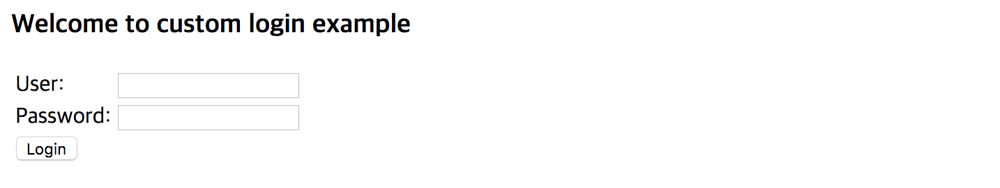

# Nginx 설정

### N**ginx 디렉터리 구조**

#### redhat 계열

```text
HTML 파일
/usr/share/nginx/html

설정 파일
/etc/nginx/conf.d
```

#### debian 계열

```text
HTML 파일
/var/www/html

설정 파일
/etc/nginx/sites-enabled
```

### **로그인 페이지 작성**

#### login.html

login.html 파일을 다음과 같이 작성합니다.

이후, **redhat 계열**일 경우,  **/usr/share/nginx/html,**

**debian 계열**일 경우, **/var/www/html** 디렉터리 아래에 위치시킵니다.

```markup
<html>
  <head>
    <title>Custom Login Page</title>
  </head>
  <body>
    <h3>Welcome to custom login example</h3>
    <div>
      <form action="/login" method="post">
        <table>
          <tr><td>User:</td><td><input type="text" id="username" name="username"/></td></tr>
          <tr><td>Password:</td><td><input type="password" id="password" name="password"/></td></tr>
          <tr><td colspan='2'> <button type="submit" class="btn">Login</button></td></tr>
        </table>
      </form>
    </div>
  </body>
</html>
```

### N**ginx 설정**

#### N**ginx 기본 설명**

사용자 정의 로그인 페이지 설정에 필요한 부분만 설명하였습니다.

```text
root : html 파일을 참조할 경로 지정
    ex) root /usr/share/nginx/html; -> /usr/share/nginx/html 아래 있는 html 파일을 참조하게 해줍니다.

location : 사용자가 접근하려는 경로에 대한 제어를 가능하게 해줍니다.
    ex) location / {}  -> root 경로로 접근할 경우 제어

proxy_pass : 내부적으로 처리할 URI로 연결해줍니다.
    ex) proxy_pass http://localhost:8080; -> 어떤 URI로 접근 하더라도 localhost:8080 에서 처리가능하게 해줍니다.

root : html 파일을 참조할 경로 지정
    ex) root /usr/share/nginx/html; -> /usr/share/nginx/html 아래 있는 html 파일을 참조하게 해줍니다.

try_files : root 경로 아래서 참조할 파일을 찾아줍니다.
    ex) location /test {
            try_files $uri /login.html; -> /test로 접근할 경우 login.html 페이지를 보여줍니다.
        }
```

#### **default customization**

Nginx 설정은 다음과 같습니다.

**redhat 계열**은 **/etc/nginx/conf.d** 아래의 **default.conf** 파일을 수정해야 하며,

**debian 계열**은 **/etc/nginx/sites-enabled** 아래의 **default** 파일을 수정하면 됩니다.

\#은 주석을 의미하므로 OS에 맞게 설정하면 됩니다.

```text
server {
        listen 80 default_server;
        listen [::]:80 default_server;

        # redhat 계열
        # root /usr/share/nginx/html;

        # debian 계열
        # root /var/www/html;

        server_name _;

        location / {
          proxy_set_header X-Forwarded-For $remote_addr;
          proxy_set_header Host $http_host;
          proxy_pass "http://127.0.0.1:8080";
        }

        location /login {
          if ( $request_method = POST ) {
            proxy_pass http://localhost:8080;
          }

          try_files $uri /login.html;
        }

        location ~* \.(css|jpg|jpeg|png|js)$ {
          # redhat 계열
          # root /usr/share/nginx/html/public;

          # debian 계열
          # root /var/www/html/public;
          break;
        }
 }
```

Coinstack SignOn과 **같은 서버**에 구동하였고 **default 포트**가 **8080**이기 때문에 **proxy\_pass**를 [http://localhost:8080\*\*](http://localhost:8080**) \*\*으로 설정해 주었습니다.

Login 경로는 **2가지**의 처리를 담당합니다.

* **Login 페이지**를 표현 \(Request method **GET** 방식\)
* Login 페이지로부터 전달받는 **데이터를 처리**\(Request method **POST** 방식\)

두가지 처리를 구분하기 위해 if 문으로 request\_method 값을 체크하였습니다.

※ Nginx 설정 변경 후 반드시 Nginx를 **재시작**해야 변경 결과가 적용되며, 관련 명령어는 [환경 구성](undefined.md)을 참조하시기 바랍니다.



