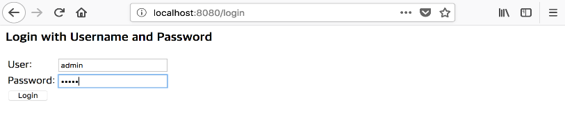
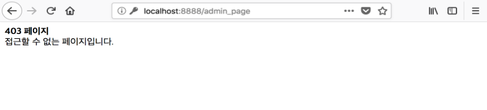
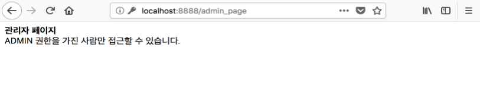

# 권한 제어

### 환경 설정

본 예제를 실행하기 위해 환경 설정은 다음과 같은 순서로 진행합니다.

#### 클라이언트 등록

```text
$ coinstack-signon client create --privatekey ${ADMIN_PRIVATEKEY} <<EOF
{
  "clientId": "trusted",
  "clientSecret": "secret",
  "authorizedGrantTypes": ["authorization_code"],
  "scopes": ["read", "write"],
  "registeredRedirectUris": ["http://localhost:8888"]
}
EOF
```

#### 사용자 등록

```text
$ coinstack-signon user create --privatekey ${ADMIN_PRIVATEKEY} <<EOF
{
  "username": "admin",
  "password": "admin",
  "authorities": ["ADMIN"]
}
EOF

$ coinstack-signon user create --privatekey ${ADMIN_PRIVATEKEY} <<EOF
{
  "username": "user",
  "password": "password",
  "authorities": ["USER"]
}
EOF
```

#### SignOn 서버 구동

```text
$ coinstack-signon server start
```

이에 대한 자세한 사항은 [서버](../../getting_started/server/), [클라이언트](../../getting_started/client.md), [사용자](../../getting_started/user.md)를 참조하시기 바랍니다.

### 리소스 만들기

사용자가 접근하는 리소스\(페이지\)를 작성합니다.

리소스 파일은 다음과 같으며, ${PROJECT\_HOME}/src/main/webapp 디렉터리에 생성합니다.

#### user\_page.jsp

```markup
<%@ page language="java" contentType="text/html; charset=UTF-8" pageEncoding="UTF-8"%>
<!DOCTYPE html PUBLIC "-//W3C//DTD HTML 4.01 Transitional//EN" "http://www.w3.org/TR/html4/loose.dtd">
<html>
<head>
    <title>User page</title>
</head>
<body>
    <b>사용자 페이지</b><br>
    USER, ADMIN 권한을 가진 사람이 접근할 수 있습니다.
</body>
</html>
```

#### admin\_page.jsp

```markup
<%@ page language="java" contentType="text/html; charset=UTF-8" pageEncoding="UTF-8"%>
<!DOCTYPE html PUBLIC "-//W3C//DTD HTML 4.01 Transitional//EN" "http://www.w3.org/TR/html4/loose.dtd">
<html>
<head>
    <title>Admin page</title>
</head>
<body>
    <b>관리자 페이지</b><br>
    ADMIN 권한을 가진 사람만 접근할 수 있습니다.
</body>
</html>
```

#### 403\_page.jsp

```markup
<%@ page language="java" contentType="text/html; charset=UTF-8" pageEncoding="UTF-8"%>
<!DOCTYPE html PUBLIC "-//W3C//DTD HTML 4.01 Transitional//EN" "http://www.w3.org/TR/html4/loose.dtd">
<html>
<head>
    <title>403 page</title>
</head>
<body>
    <b>403 페이지</b><br>
    접근할 수 없는 페이지입니다.
</body>
</html>
```

### 리소스별 접근 권한

생성한 페이지에 대한 접근 권한은 다음과 같습니다.

| **사용자** | user\_page.jsp | admin\_page.jsp |
| --- | --- | --- |
| admin | O | O |
| user | O | 접근 권한이 없으므로 403\_page.jsp로 이동 |

### 권한 제어 서블릿 필터 만들기

다음의 코드는 SSO 서블릿 필터 코드에 권한 제어 코드를 추가한 것입니다.

SSO 서블릿 필터 코드와 관련된 설명, 설정은 [Servlet 기반의 리소스 서버 만들기](resource_server.md)를 참조하시기 바랍니다.

권한 제어에서 필터의 흐름과 이에 따른 코드는 다음과 같습니다.


#### SSOFilter.java

```java
@WebFilter("*")
public class SSOFilter implements Filter {
  private AuthService authService = new AuthService();

  @Override
  public void init(final FilterConfig filterConfig) throws ServletException {
    System.out.println("Initializing filter...");
  }

  @Override
  public void doFilter(final ServletRequest request, final ServletResponse response,
      final FilterChain chain) throws IOException, ServletException {

    HttpServletRequest req = (HttpServletRequest) request;
    HttpServletResponse res = (HttpServletResponse) response;

    try {
      if (authService.hasAccessToken(req)) {
        if (authService.verifyAccessToken(req)) {
          // 1. Check authorities
          if (authService.checkAuthorities(req)) {
            chain.doFilter(req, res);
          } else {
            res.sendRedirect("/403_page.jsp");
          }
        } else {
          authService.removeAccessTokenFromCookie(req, res);
          authService.requestAuthCode(req, res);
        }
      } else {
        if (req.getParameter("code") != null) {
          authService.addAccessTokenToCookie(req, res);
          res.sendRedirect(req.getRequestURI());
        } else {
          authService.requestAuthCode(req, res);
        }
      }

    } catch (Exception e) {
      e.printStackTrace();
    }
  }

  @Override
  public void destroy() {
    System.err.println("Destroying filter...");
  }
}
```

#### AuthService.java

Authorization service를 지원해주는 클래스로 권한 제어를 제공하기 위해 다음과 같은 메서드를 사용합니다.

```java
public class AuthService {
  private static final String CLIENT_ID = "trusted"; // 클라이언트 ID
  private static final String SECRET = "secret"; // 클라이언트 비밀번호
  private static final String GRANT_TYPE = "authorization_code"; // 권한 취득 방식
  private static final String SCOPE = "read"; // 접근 제어 범위
  private static final String RESPONSE_TYPE = "code"; // 인증서버 응답 방식
  private static final String SERVER_DOMAIN = "http://localhost:8888"; // SSO 서버의 주소
  private static final String ENDPOINT = "http://localhost:8080";// OAuth 서버의 주소

  // =============== SSO methods ================ //
  // 1. hasAccessToken
  // 2. findAccessTokenFromCookie
  // 3. addAccessTokenToCookie
  // 4. requestAuthCode
  // 5. verifyAccessToken
  // 6. getAccessTokenInfo
  // 7. removeAccessTokenFromCookie
  // ============================================ //

  // ========== Access Control methods ========== //
  // 1. checkAuthorities
  // 2. getAuthorities
  // 3. arrangeAuthorities
  //============================================= //
}
```

**checkAuthorities**

사용자의 권한을 체크해주는 메서드입니다.

getAuthorities 메서드 반환값을 통해 사용자가 접근하려는 페이지에 접근 권한이 있는지 판단합니다.

접근 권한이 없는 페이지에 접근하는 경우 false 값을 반환합니다.

```java
  /**
   * 권한체크 메서드.
   * 
   * @param req HttpServletRequest
   * @throws Exception Exception
   */
  public boolean checkAuthorities(HttpServletRequest req) throws Exception {
    Boolean result = false;
    String[] authorities = getAuthorities(req);
    if ("/admin_page.jsp".equals(req.getRequestURI())) {
      for (String authority : authorities) {
        if (authority.equals("ADMIN")) {
          result = true;
          break;
        }
      }
    } else {
      result = true;
    }

    return result;
  }
```

**getAuthorities**

Access token의 권한정보를 가져오는 메서드입니다.

getAccessTokenInfo 메서드의 반환값 중 authorities를 추출하고 arrangeAuthorities 메서드를 이용해 정리하여 반환합니다.

```java
  /**
   * accessToken 권한정보를 가져오는 메서드.
   * 
   * @param req HttpServletRequest
   * @throws Exception Exception
   */
  private String[] getAuthorities(HttpServletRequest req) throws Exception {
    JSONObject accessTokenInfo = getAccessTokenInfo(req);
    return arrangeAuthorities(accessTokenInfo.getString("authorities"));
  }
```

**arrangeAuthorities**

String 형태의 Authorities를 String 배열로 정돈시키는 메서드입니다.

String 형태의 Authorities를 정규 표현식으로 정돈하여 String 배열 형태로 Authorities를 반환합니다.

```java
 /**
   * String으로 넘어오는 authorities를 array로 깔끔하게 만들어 주는 메서드.
   * 
   * @param authorities authorities
   * @return
   */
  private String[] arrangeAuthorities(String authorities) {
    // beautify userAuth
    String[] authList;
    authList = authorities.split(",");
    for (int i = 0; i < authList.length; i++) {
      authList[i] = authList[i].replaceAll("[\\\"\\[\\]]", "");
    }
    return authList;
  }
```

### 실행 결과

#### 사용자 페이지

[localhost:8888/user\_page.jsp](localhost:8888/user_page.jsp)로 접속하면 SignOn 서버에서 권한을 체크하고 로그인 페이지로 리다이렉션합니다.


이후 관리자 계정인 admin과 일반 사용자 계정인 user로 각각 로그인합니다.




이처럼 user\_page.jsp는 모든 사용자가 접근할 수 있습니다.


#### 관리자 페이지

[localhost:8888/admin\_page.jsp](localhost:8888/admin_page.jsp)로 접속하면 SignOn 서버에서 권한을 체크하고 로그인 페이지로 리다이렉션합니다.

이후 admin\_page.jsp의 접근 권한이 없는 user로 로그인합니다.


user는 admin\_page.jsp의 접근 권한을 갖고 있지 않기 때문에 403\_page.jsp로 리다이렉션합니다.



admin\_page.jsp의 접근 권한을 가진 admin으로 로그인합니다.


admin은 admin\_page.jsp의 접근 권한을 갖고 있기 때문에 해당 페이지로 리다이렉션합니다.



