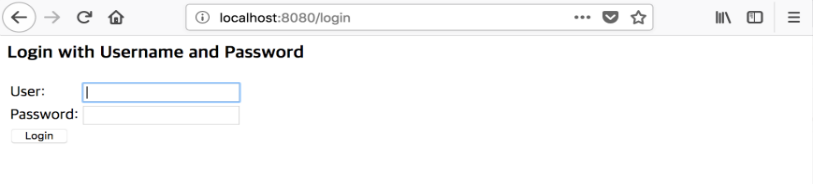

# 리소스 서버 만들기

## 환경 설정

본 예제를 실행하기 위해 환경 설정은 다음과 같은 순서로 진행합니다.

### 클라이언트 등록

```text
$ coinstack-signon client create --privatekey ${ADMIN_PRIVATEKEY} <<EOF
{
  "clientId": "trusted",
  "clientSecret": "secret",
  "authorizedGrantTypes": ["authorization_code"],
  "scopes": ["read", "write"],
  "registeredRedirectUris": ["http://localhost:8888"]
}
EOF
```

### 사용자 등록

```text
$ coinstack-signon user create --privatekey ${ADMIN_PRIVATEKEY} <<EOF
{
  "username": "user",
  "password": "password",
  "authorities": ["USER"]
}
EOF
```

### SignOn 서버 구동

```text
$ coinstack-signon server start
```

이에 대한 자세한 설정은 [서버](../../getting_started/server/), [클라이언트](../../getting_started/client.md), [사용자](../../getting_started/user.md)를 참조하시기 바랍니다.

## 리소스 만들기

사용자가 접근하는 리소스\(페이지\)를 작성합니다.

리소스 파일은 다음과 같으며, ${PROJECT\_HOME}/src/main/webapp 디렉터리에 생성합니다.

### main\_page.jsp

```text
<%@ page language="java" contentType="text/html; charset=UTF-8" pageEncoding="UTF-8"%>
<!DOCTYPE html PUBLIC "-//W3C//DTD HTML 4.01 Transitional//EN" "http://www.w3.org/TR/html4/loose.dtd">
<html>
<head>
    <title>Main page</title>
</head>
<body>
    <b>메인 페이지</b><br>
    Coinstack SSO 예제에 오신걸 환영합니다.
</body>
</html>
```

## 페이지 확인

페이지 확인을 위해 서버를 구동합니다. ${PROJECT\_HOME}에서 다음의 명령어를 실행합니다.

!FILENAME _Servlet_

```text
$ mvn jetty:run
```

!FILENAME _Spring_

```text
$ mvn spring-boot:run -Dspring.profiles.active=development
```

서버가 구동되면 브라우저를 이용해서 [http://localhost:8888/main\_page.jsp](http://localhost:8888/main_page.jsp)에 접근해봅니다.


## Client 정보

다음은 사용자 인증에 필요한 데이터 목록입니다.

### 서블릿 필터 만들기

@WebFilter는 필터를 적용할 범위를 지정할 수 있습니다.

예제 코드에서는 "\*" 로 설정하며 Request로 들어오는 모든 URI에 대해 필터를 적용하였습니다.

SSO에서 필터의 흐름과 이에 따른 코드는 다음과 같습니다.


### SSOFilter.java

```java
@WebFilter("*")
public class SSOFilter implements Filter {
  private AuthService authService = new AuthService();

  @Override
  public void init(final FilterConfig filterConfig) throws ServletException {
    System.out.println("Initializing filter...");
  }

  @Override
  public void doFilter(final ServletRequest request, final ServletResponse response,
      final FilterChain chain) throws IOException, ServletException {

    // Common Request, Response
    HttpServletRequest req = (HttpServletRequest) request;
    HttpServletResponse res = (HttpServletResponse) response;

    try {
      // 1. Get access token
      if (authService.hasAccessToken(req)) {
        // 2. Check validity for access token
        if (authService.verifyAccessToken(req)) {
          chain.doFilter(req, res);
        } else {
          authService.removeAccessTokenFromCookie(req, res);
          authService.requestAuthCode(req, res);
        }
      } else {
        // 3. Redirect to oauth server's login form
        if (req.getParameter("code") != null) {
          authService.addAccessTokenToCookie(req, res);
          res.sendRedirect(req.getRequestURI());
        } else {
          authService.requestAuthCode(req, res);
        }
      }

    } catch (Exception e) {
      e.printStackTrace();
    }
  }

  @Override
  public void destroy() {
    System.err.println("Destroying filter...");
  }
}
```

### AuthService.java

Authorization Service를 지원하는 클래스로 SSO를 제공하기 위해 다음과 같은 메서드들을 사용합니다.

```java
public class AuthService {
  private static final String CLIENT_ID = "trusted"; // 클라이언트 ID
  private static final String SECRET = "secret"; // 클라이언트 비밀번호
  private static final String GRANT_TYPE = "authorization_code"; // 권한 취득 방식
  private static final String SCOPE = "read"; // 접근 제어 범위
  private static final String RESPONSE_TYPE = "code"; // 인증서버 응답 방식
  private static final String SERVER_DOMAIN = "http://localhost:8888"; // SSO 서버의 주소
  private static final String ENDPOINT = "http://localhost:8080";// OAuth 서버의 주소

  // =============== SSO methods ================ //
  // 1. hasAccessToken
  // 2. findAccessTokenFromCookie
  // 3. addAccessTokenToCookie
  // 4. requestAuthCode
  // 5. verifyAccessToken
  // 6. getAccessTokenInfo
  // 7. removeAccessTokenFromCookie
  // ============================================ //
}
```

**hasAccessToken**

Access token이 있는지 판단해주는 메서드입니다.

findAccessTokenFromCookie 메서드 반환값 통해 Access token 존재 여부를 확인해줍니다.

```java
  /**
   * AccessToken 유무 확인.
   * 
   * @param req HttpServletRequest
   * @return
   */
  public boolean hasAccessToken(HttpServletRequest req) {
    boolean result = false;
    if (findAccessTokenFromCookie(req) != null) {
      // accessToken이 있는 경우
      result = true;
    }
    return result;
  }
```

**findAccessTokenFromCookie**

Cookie 값 중 Access token 을 찾아주는 메소드입니다.

값이 없는 경우 null 값을 반환합니다.

```java
  /**
   * Cookie 에서 accessToken값을 찾는 함수.
   * 
   * @param req HttpServletRequest
   * @return
   */
  private String findAccessTokenFromCookie(HttpServletRequest req) {
    String result = null;
    Cookie[] cookies = req.getCookies();
    if( null != cookies ) {
      for (int i = 0; i < cookies.length; i++) {
        if ("accessToken".equals(cookies[i].getName())) {
          result = cookies[i].getValue();
        }
      }
    }
    return result;
  }
```

**addAccessTokenToCookie**

Access token을 받아와 Cookie에 추가해주는 메서드입니다.

Login form으로 리다이렉션 후 Resource owner가 로그인할 때 발급되는 Auth code, Grant type, Redirectionuri를

SignOn 서버의 /oauth/token으로 Post 하여 JSONObject 형태의 Access token을 Cookie에 추가합니다.

Auth code가 존재하면 Auth code에 따른 Access token을 Cookie에 추가하는 역할을 합니다.

따라서 Access token을 Cookie에 등록 및 공유하여 SSO 로그인을 가능하게 합니다.

```java
  /**
   * Access token을 가져와 Cookie에 추가하는 메서드.
   * @param authCode String
   * @param req HttpServletRequest
   * @param res HttpServletResponse
   */
  public void addAccessTokenToCookie(HttpServletRequest req, HttpServletResponse res)
      throws Exception {
    String getToken = ENDPOINT + "/oauth/token";
    String data = "grant_type=" + GRANT_TYPE + "&redirect_uri=" + SERVER_DOMAIN
        + req.getRequestURI() + "&code=" + req.getParameter("code");
    String clientInfo = CLIENT_ID + ":" + SECRET;
    String accessInfo = sendPost(getToken, data, clientInfo);
    if (accessInfo != null) {
      JSONObject accessInfoJson = new JSONObject(accessInfo);

      Cookie cookie = new Cookie("accessToken", accessInfoJson.getString("access_token"));
      res.addCookie(cookie);
    }
  }
```

**requestAuthCode**

Auth code를 요청하는 메서드 입니다.

접근 하려는 사용자가 Access token 이 없는경우 SignOn 서버의 oauth/authorize로 리다이렉션 하여 권한 인증을 하게합니다.

권한 인증의 결과값은 ?code= 형태로 반환됩니다.

```java
 /**
   * authCode 요청 (loginPage 리다이렉션).
   * 
   * @param req HttpServletRequest
   * @param res HttpServletResponse
   * @throws IOException IOException
   */
  public void requestAuthCode(HttpServletRequest req, HttpServletResponse res) throws IOException {
    res.sendRedirect(ENDPOINT + "/oauth/authorize?response_type=" + RESPONSE_TYPE + "&grant_type="
        + GRANT_TYPE + "&scope=" + SCOPE + "&client_id=" + CLIENT_ID + "&secret=" + SECRET
        + "&redirect_uri=" + SERVER_DOMAIN + req.getRequestURI().toString());
  }
```

**verifyAccessToken**

Access token이 있는지 유효한지 판단해주는 메서드 입니다.

getAccessTokenInfo 메서드 반환값 통해 Access token 유효여부를 확해줍니다.

```java
  /**
   * accessToken 증명.
   * 
   * @param req HttpServletRequest
   * @throws Exception Exception
   */
  public boolean verifyAccessToken(HttpServletRequest req) throws Exception {
    boolean result = false;
    if (getAccessTokenInfo(req) != null) {
      // accessToken이 유효한 경우
      result = true;
    }
    return result;
  }
```

**getAccessTokenInfo**

Access token의 등록정보를 가져오는 메서드 입니다.

SignOn 서버의 /oauth/check\_token 으로 엑세스 토큰값을 POST하여 JSONObject 형태의 등록정보를 가져옵니다.

엑세스 토큰값이 유효하지 않은경우 null값을 반환합니다.

```java
  /**
   * accessToken 정보를 읽어오는 메서드.
   * 
   * @param req HttpServletRequest
   * @throws Exception Exception
   */
  private JSONObject getAccessTokenInfo(HttpServletRequest req) throws Exception {
    String checkAt = "token=" + findAccessTokenFromCookie(req);
    String auth = CLIENT_ID + ":" + SECRET;
    String checkToken = ENDPOINT + "/oauth/check_token";
    JSONObject result = null;

    String response = sendPost(checkToken, checkAt, auth);
    if (response != null) {
      result = new JSONObject(response);
    }
    return result;
  }
```

**removeAccessTokenFromCookie**

Access token이 유효하지 않은 경우 Cookie에서 Access token을 제거하는 메서드입니다.

Cookie의 setMaxAge 메서드를 통해 Cookie의 유효기간을 0으로 설정하여 유효하지 않은 Access token을 제거합니다.

```java
 /**
   * AccessToken이 유효하지 않은 경우 Cookie값을 삭제하는 메서.
   * @param req HttpServletRequest
   * @param res HttpServletResponse
   */
  public void removeAccessTokenFromCookie(HttpServletRequest req, HttpServletResponse res) 
      throws Exception {
    for (Cookie cookie : req.getCookies()) {
      cookie.setMaxAge(0);
      res.addCookie(cookie);
    }
  }
```

**sendPost**

SignOn 서버의 /oauth/token이나 /oauth/check\_token으로 HTTP POST 요청 및 응답을 하는 메서드입니다.

/oauth/token으로 POST 요청을 하여 String 형태의 Access token을 반환합니다.

/oauth/check\_token으로 POST 요청을 하여 String 형태의 User info를 반환합니다.

```java
 /**
   * HTTP POST 요청/응답 메서드.
   * @param uri String
   * @param params String
   * @param clientInfo String
   * @return data String
   */
private String sendPost(String uri, String params, String clientInfo) throws Exception {

  URL url = new URL(uri);
  HttpURLConnection con = (HttpURLConnection) url.openConnection();
  if (clientInfo != null) {
    String userpass = clientInfo;
    String basicAuth =
        "Basic " + javax.xml.bind.DatatypeConverter.printBase64Binary(userpass.getBytes());
    con.setRequestProperty("Authorization", basicAuth);
  }
  con.setRequestMethod("POST");
  con.setDoOutput(true);

  PrintWriter pw = new PrintWriter(new OutputStreamWriter(con.getOutputStream(), "UTF-8"));
  pw.write(params);
  pw.flush();

  String line;
  String data = "";
  String result = null;

  if (con.getResponseCode() != 400) {
    BufferedReader br = new BufferedReader(new InputStreamReader(con.getInputStream(), "UTF-8"));
    while ((line = br.readLine()) != null) {
      data += line + "\n";
    }

    pw.close();
    br.close();
    result = data;
  }
  return result;
}
```

## 실행 결과

테스트를 위해 다음과 같이 프로젝트를 복사합니다.


### Servlet

복사한 프로젝트의 포트 번호를 8889로 다음과 같이 변경합니다.

"pom.xml"에서 포트를 변경합니다.

```markup
<httpConnector>
  <port>8889</port>
</httpConnector>
```

이후, 두 서버를 구동하기 위해 각각의 ${PROJECT\_HOME}에서 다음의 명령어를 실행합니다.

!FILENAME _Servlet_

```text
$ mvn jetty:run
```

### Spring

복사한 프로젝트의 포트 번호를 8889로 다음과 같이 변경합니다.

"application-development.yaml" 에서 포트를 변경합니다.

```yaml
server:
  ...
  port : 8889
```

이후, 두 서버를 구동하기 위해 각각의 ${PROJECT\_HOME}에서 다음의 명령어를 실행합니다.

!FILENAME _Spring_

```text
$ mvn spring-boot:run -Dspring.profiles.active=development
```

localhost:8888/main\_page.jsp로 접속하면 SignOn 서버의 로그인 페이지로 리다이렉션됩니다.



이후, 등록한 사용자 인증 정보로 다음과 같이 로그인을 합니다.


로그인이 성공하면 localhost:8888/main\_page.jsp로 리다이렉션되는 것을 확인할 수 있습니다.


이후, localhost:8889/main\_page.jsp로 접속하면 별도의 인증 절차 없이 메인 페이지를 확인할 수 있습니다.


