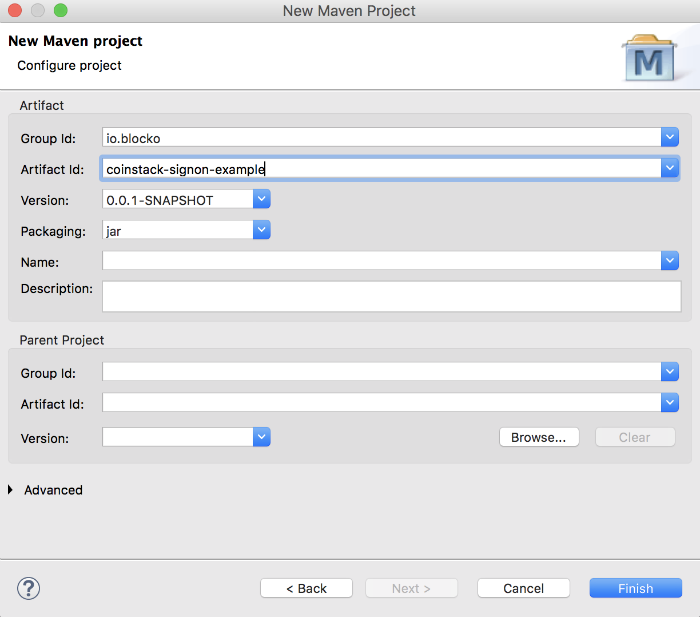
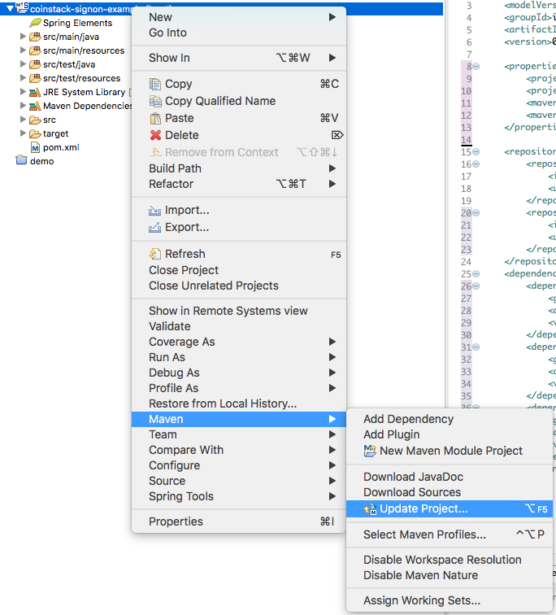

# 프로젝트 설정

본 장에서는 Eclipse와 Maven을 이용하여 개발 환경을 구성하는 방법에 관하여 설명합니다.

### Eclipse에서 Maven 프로젝트 생성하기

메뉴에서 File -&gt; New를 선택하고, 리스트에서 **Maven Project**를 선택하고 다음으로 진행합니다.


**Create a simple project**를 체크하고, 다음 단계로 진행합니다.


&lt;group-id&gt;와 &lt;artifact-id&gt;를 입력하고, 과정을 종료하면 프로젝트가 생성됩니다.



### pom.xml 설정하기

개발을 진행하기 위해서는 Maven 저장소에서 라이브러리들을 가져와야 합니다. BLOCKO, Inc는 개발에 필요한 모든 라이브러리를 인터넷을 통해 제공합니다. 인터넷이 단절된 환경에서 개발하기 위해서는 해당 라이브러리를 직접다운로드받아서 프로젝트를 구성할 수 있습니다. 관련 라이브러리를 프로젝트에 포함하기 위해서는${PROJECT\_HOME}/pom.xml 파일을 수정해야 합니다.

#### 라이브러리 추가

pom.xml에서는 라이브러리를 가져오기 위해서 Maven 저장소 정보를 입력하고, 필요한 라이브러리를 의존성에 정의합니다.

```markup
  ...
  <properties>
    <project.build.sourceEncoding>utf-8</project.build.sourceEncoding>
    <project.reporting.outputEncoding>utf-8</project.reporting.outputEncoding>
    <maven.compiler.source>1.8</maven.compiler.source>
    <maven.compiler.target>1.8</maven.compiler.target>
  </properties>

  <repositories>
    <repository>
      <id>blocko-maven-release-repository</id>
      <url>https://nexus.blocko.io/repository/blocko-maven-release-repository/</url>
    </repository>
  </repositories>
  <dependencies>
    <dependency>
      <groupId>io.blocko</groupId>
      <artifactId>coinstack-signon-user</artifactId>
      <version>1.0</version>
    </dependency>
    <dependency>
      <groupId>io.blocko</groupId>
      <artifactId>coinstack-signon-common</artifactId>
      <version>1.0</version>
    </dependency>
    <dependency>
      <groupId>io.blocko</groupId>
      <artifactId>coinstack-spring</artifactId>
      <version>0.4</version>
    </dependency>

  </dependencies>
  ...
```

### 프로젝트 업데이트

**pom.xml**에 정의한 라이브러리들을 Maven 저장소로부터 가져오려면 해당 프로젝트를 우클릭 -&gt; Maven -&gt; Update Project...를 선택합니다.



선택을 완료하면, Maven 저장소로부터 자동적으로 로컬 저장소로 라이브러리들이 다운로드되어집니다.

