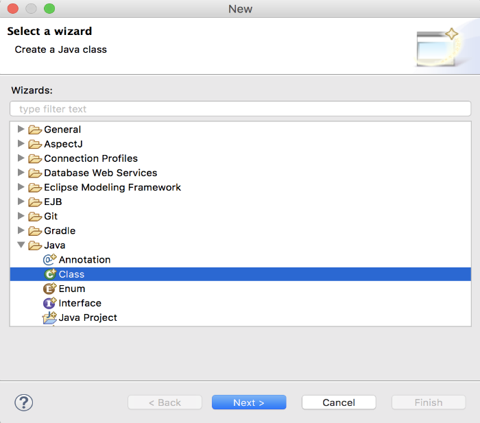
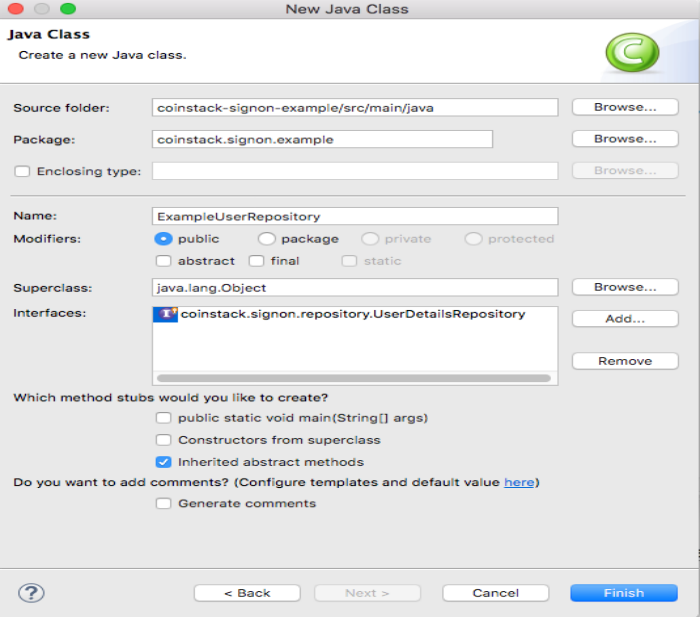

# 사용자 인증 정보 저장소 구현

Maven 저장소를 통해 받은 coinstack-signon-user.jar 파일 안에는 사용자 인증 정보 저장소 변경에 대비하여coinstack.signon.repository 패키지 안에 UserDetailsRepository 인터페이스를 제공합니다.

본 예제는 UserDetailsRepository 인터페이스를 이용한 사용자 인증 정보 저장소 구현에 대하여 설명합니다.

### 사용자 인증 정보 저장소 클래스 생성

해당 프로젝트를 선택하고 메뉴에서 File &gt; New 그리고 Other..을 선택합니다. 그 후, 새 창이 나오면 목록에서Java Class를 선택합니다.



사용자 인증 정보 저장소로 사용할 클래스의 이름을 입력하고,coinstack.signon.repository.UserDetailsRepository를 인터페이스로 추가합니다.



### UserDetailsRepository를 이용한 사용자 인증 정보 저장소 구현

UserDetailsRepository를 통해 ExampleUserRepository에는 다음과 같은 delete, findByUsername, save메소드가 강제되고, 이를 통해 Coinstack SignOn과 호환 가능한 사용자 인증 정보 저장소를 구현할 수 있습니다.

예제에서는 **test-pass**라는 패스워드로 인증을 하고, **USER**라는 역할\(권한\)을 가진 **test-user**라는 사용자가 저장된 간단한 사용자 인증 정보 저장소를 구현합니다. 요건에 따라 LDAP, Active Directory 또는 기타 인증 서버로부터 사용자 정보를 가져오는 것을 구현함으로써 연동할 수 있습니다.

#### ExampleUserRepository.java

```java
package coinstack.signon.example;

import static java.util.Arrays.asList;

import coinstack.signon.model.User;
import coinstack.util.Sha256PasswordEncoder;
import java.util.Optional;

public class ExampleUserRepository implements UserDetailsRepository {

  @Override
  public void delete(String username){
    ...
  }

  @Override
  public Optional<User> findByUsername(final String username) {
    if ("test-user".equals(username)) {
      return Optional.ofNullable(new User(username, new Sha256PasswordEncoder().encode("test-pass"), asList("USER")));
    }
    return Optional.empty();
  }

  @Override
  public void save(User user){
    ...
  }
}
```

본 예제는 클래스 하나로 구성되어 있으나 여러 클래스로 구성된 모듈이어도 상관없습니다.

