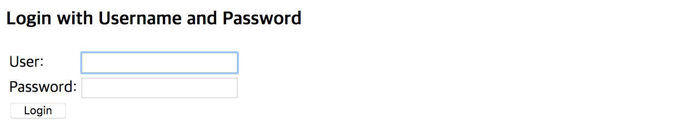
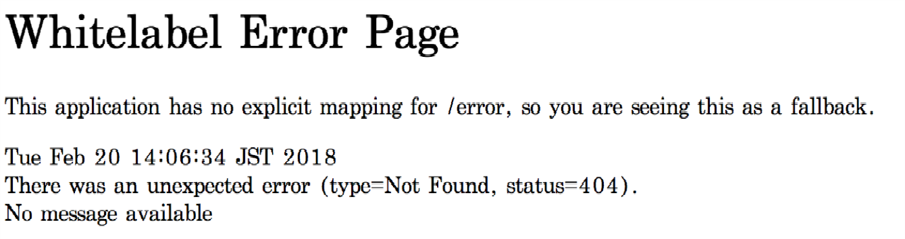

# SignOn 서버와 통합

### 개발된 모듈 빌드하기

Maven을 실행함으로써 모듈을 빌드해서 archive\(본 예제에서는 coinstack-signon-example-${version}.jar\) 파일을 생성할 수 있습니다.

```text
$ mvn clean package
```

빌드된 archive 파일은 ${PROJECT\_HOME}/target 에서 찾을 수 있습니다.

### 모듈 배치\(deploy\)하기

사용자 모듈을 배치\(deploy\)하는 과정은 따로 없습니다. 라이브러리를 ${INSTALL\_PATH}/lib에 위치시키는 것으로 배치는 끝납니다. 만일 서버가 동작 중이라면, 자동으로 반영되는 것이 아니므로 서버를 재시작해야 합니다.

### 모듈 로드 설정

서버가 모듈을 로드하기 위해서는 로드할 클래스의 이름을 알아야 합니다. 설정을 위해 ${INSTALL\_PATH}/conf에 위치해있는 coinstack.yaml파일에 추가합니다. 추가가 완료되면 서버를 재시작하여 모듈을 적용시킵니다.

#### coinstack.yaml

```text
signon:
  server:
    user-repository: coinstack.signon.example.ExampleUserRepository
```

### 동작 확인

#### 로그인 페이지

브라우저의 주소창에 [http://${SERVER\_HOSTNAME}:${SERVER\_PORT}/welcome.html](http://${SERVER_HOSTNAME}:${SERVER_PORT}/welcome.html)를 입력하면,

설정에 의해 로그인 페이지로 리다이렉트되면서 다음과 같은 화면을 볼 수 있습니다.



**User**와 **Password**에 [사용자](../../getting_started/user.md)에서 등록한 사용자를 입력합니다. 해당 사용자와 패스워드는 기본 모듈의 사용자 정보 저장소에 등록된 사용자 정보입니다. 즉, 새로운 모듈을 적용하였으므로, 다음과 같이 로그인에 실패해야 합니다.


이제 다시 새로 만든 모듈의 사용자 정보로 로그인을 시도합니다.

**User**에 , **Password**에 를 입력하면 다음과 같은 페이지를 볼 수 있습니다.


만일 다음과 같은 페이지를 보게 된다면, URL이 올바르지 않은 경우입니다. 하지만, 인증을 통과한 것이기 때문에 올바르게 테스트한 것입니다. 아래 이미지는 [http://${SERVER\_HOSTNAME}:${SERVER\_PORT}/](http://${SERVER_HOSTNAME}:${SERVER_PORT}/)로 접근한 경우 보여지는 페이지 입니다.



